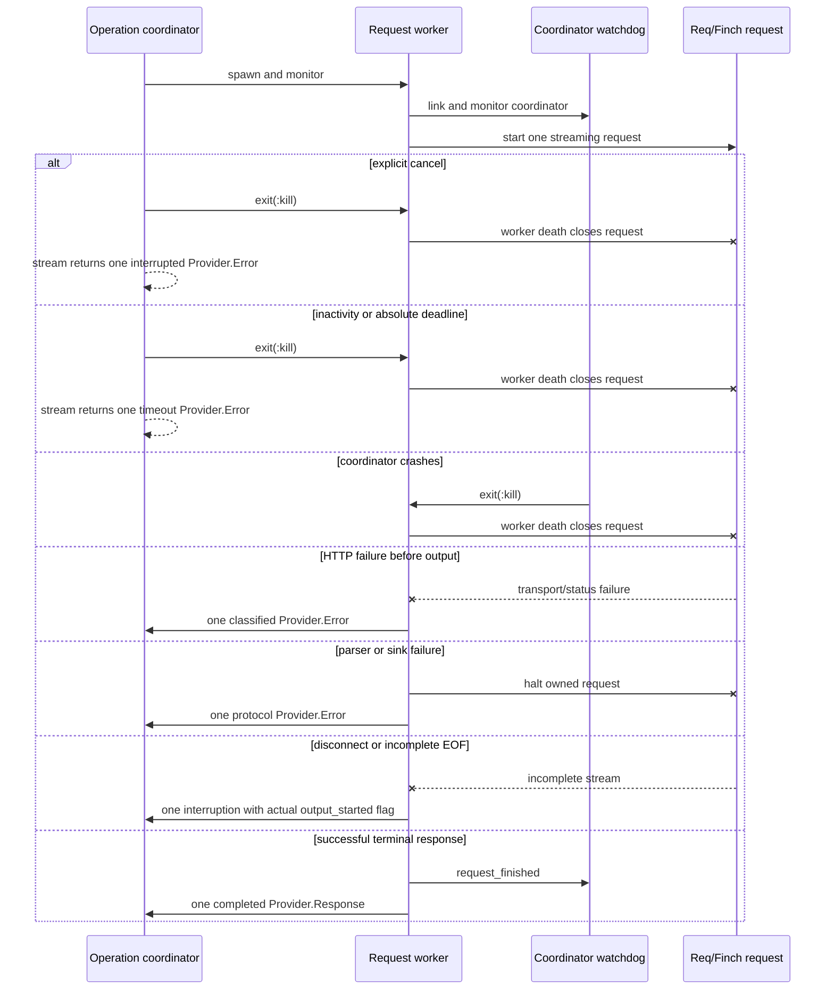

# Provider Architecture

This document defines the first-class provider requirements for Synapse, with particular focus on direct OpenAI Codex sign-in, Tokamak's Codex pool, and ordinary OpenAI-compatible local or remote endpoints.

Sections labeled **Implemented Provider** or **MVP** describe current code. Direct
Codex, generic Tokamak, additional endpoint profiles, credential brokers, and
health/discovery describe target architecture or explicitly deferred work.

The design is based on the current Tokamak implementation in the sibling `menlo/tokamak` checkout. Tokamak source paths referenced below are relative to `menlo/tokamak` and describe the inspected implementation, not a promised external API version.

## Goals

Synapse must work out of the box with:

1. A user's OpenAI Codex subscription through an explicit Codex sign-in or credential import.
2. Tokamak's Codex credential pool through a direct HTTPS integration.
3. Tokamak's generic inference API.
4. OpenAI Responses-compatible local and remote endpoints.
5. OpenAI Chat Completions-compatible local and remote endpoints.

The user should select Codex or Tokamak as Synapse's primary model provider. Synapse must not require the user to launch or wrap the `tokamak` CLI for normal inference.

## Non-Goals

- Running Codex CLI as the agent harness itself.
- Treating Tokamak's credential pool as a pool of running agents.
- Copying Tokamak's Go services into Synapse.
- Sending provider secrets through model context.
- Transparently changing models after a response has started streaming.
- Depending on unimplemented Tokamak `/v1/agent-sessions/*` design documents.
- Pretending that ChatGPT's private Codex backend is as stable as the public OpenAI API.

## Current Tokamak Findings

The current implementation establishes several important facts.

### Tokamak is an HTTP provider boundary

Synapse should connect to Tokamak's public gateway, such as `https://api.tokamak.sh`, using HTTP JSON and SSE. It should not connect directly to Tokamak core port `8090`.

The gateway authenticates the caller, replaces the public credential with a short-lived delegation token, and forwards the request to core. The relevant gateway behavior is implemented in:

- `tokamak-services/services/gateway/internal/server/server.go:264-333`
- `tokamak-services/services/gateway/internal/server/server.go:355-369`
- `tokamak-services/README.md:59-69`

There is no pool WebSocket, gRPC, IPC, agent lease, or language-specific SDK that Synapse needs to embed.

### The Codex pool contains credentials, not agents

Tokamak's pool stores Codex and Claude credentials for server-side selection. For Codex, the important endpoint is:

```http
POST /v1/agent-pool/codex-proxy/responses
Authorization: Bearer <tokamak-api-key>
Content-Type: application/json
Accept: text/event-stream
```

The route is registered in `tokamak-services/services/core/internal/handlers/agentpool/agentpool_route.go:26-53`.

There is no acquire or release operation. The proxy selects a credential for each request. The selected account is not pinned to a Synapse run, session, or turn sequence.

`GET /v1/agent-pool/launch-auth` exists for clients that need to launch an external Codex process with a credential. Synapse should not use that route for ordinary inference because the direct proxy keeps OpenAI credentials and refresh tokens on the Tokamak server.

### Tokamak does not implement initial Codex sign-in

Tokamak can import Codex `auth.json`, store an access token, accept an OpenAI API key, and refresh a stored Codex OAuth credential. It does not currently implement:

- OpenAI authorization URL construction.
- An OpenAI PKCE browser callback.
- OpenAI device authorization.
- Authorization-code exchange.
- Automatic local Codex credential discovery as part of the server API.

Direct Codex sign-in is therefore a separate Synapse responsibility. Tokamak's code is useful for understanding refresh and proxy behavior, but it cannot be reused as a complete login implementation.

### Tokamak has two different Responses paths

| Path | Behavior |
| --- | --- |
| `/v1/agent-pool/codex-proxy/responses` | Transparent proxy to ChatGPT's Codex Responses backend with immediate SSE flushing. |
| `/v1/responses` | Generic Tokamak facade implemented internally with non-streaming Chat Completions and synthesized Responses events. |

The distinction matters. The Codex pool proxy returns real incremental Codex streaming. The generic route may emit an entire answer in one large text delta after the upstream request completes.

## Architectural Principle

Wire format, endpoint behavior, credentials, and model metadata are independent axes.

Synapse should not implement a giant provider module full of endpoint conditionals. It should compose a provider from:

```text
EndpointProfile
  + WireCodec
  + CredentialReference
  + RequestPolicy
  + RetryPolicy
  + ModelMetadata
```

This allows direct OpenAI, direct Codex, Tokamak Codex pool, and compatible third-party endpoints to share protocol code without sharing unsafe assumptions.

## Proposed Elixir Modules

```text
Synapse.Provider.Registry
Synapse.Provider.Config
Synapse.Provider.EndpointProfile
Synapse.Provider.Request
Synapse.Provider.Event
Synapse.Provider.HTTPStreamWorker

Synapse.Provider.OpenAI.ResponsesCodec
Synapse.Provider.OpenAI.ResponsesStream
Synapse.Provider.OpenAI.ChatCompletionsCodec
Synapse.Provider.OpenAI.ChatCompletionsStream

Synapse.Provider.Profile.OpenAI
Synapse.Provider.Profile.OpenAICompatible
Synapse.Provider.Profile.Codex
Synapse.Provider.Profile.Tokamak
Synapse.Provider.Profile.TokamakCodexPool

Synapse.Credentials.Broker
Synapse.Credentials.Store
Synapse.Credentials.CodexOAuth
Synapse.Credentials.CodexImport
Synapse.Credentials.TokamakApiKey
```

Provider HTTP calls execute under `Task.Supervisor` or a dedicated stream worker. The run coordinator receives normalized events and never owns a blocking HTTP stream directly.

## Provider Configuration

A conceptual provider configuration is:

```elixir
%Synapse.Provider.Config{
  id: "tokamak-codex",
  profile: :tokamak_codex_pool,
  wire: :responses,
  base_url: "https://api.tokamak.sh/v1/agent-pool/codex-proxy",
  path: "/responses",
  model: "gpt-5.5",
  secret_ref: "TOKAMAK_API_KEY",
  capabilities: ["tools", "reasoning", "streaming"]
}
```

The actual configuration format may be Elixir, JSON, or TOML. Secret fields always contain symbolic references, never secret values.

## Shared Responses Codec

`Synapse.Provider.ResponsesCodec` constructs canonical OpenAI Responses requests. The separate `Synapse.Provider.ResponsesStream` consumes framed SSE data and parses Responses JSON so request encoding and incremental response state remain independently testable.

### Canonical request

```json
{
  "model": "gpt-5.5",
  "instructions": "You are a coding agent.",
  "input": [
    {
      "type": "message",
      "role": "user",
      "content": [
        {"type": "input_text", "text": "Inspect the project"}
      ]
    }
  ],
  "tools": [
    {
      "type": "function",
      "name": "read",
      "description": "Read a file",
      "parameters": {
        "type": "object",
        "properties": {"path": {"type": "string"}},
        "required": ["path"]
      }
    }
  ],
  "stream": true,
  "store": false
}
```

The canonical internal tool model uses flat Responses function fields. Endpoint profiles may transform it only at the final request boundary.

### SSE parser requirements

HTTP chunks do not correspond to SSE lines, events, JSON values, or tool arguments. The parser must:

- Buffer partial lines across arbitrary HTTP chunks.
- Support `event:` and one or more `data:` fields.
- Recognize blank-line event boundaries.
- Tolerate comment and heartbeat lines.
- Support `[DONE]` where present without requiring it.
- Ignore unknown future event types while preserving diagnostics.
- Bound individual lines, events, and the total buffered payload.
- Cancel the Req or Finch operation when the run is cancelled.
- Reject incomplete function arguments after a failed or truncated stream.

### Event normalization

| Responses event | Synapse event |
| --- | --- |
| `response.created` | `MessageStarted` |
| `response.output_text.delta` | `TextDelta` |
| `response.output_item.added` with `function_call` | `ToolCallStarted` |
| `response.function_call_arguments.delta` | `ToolCallDelta` |
| `response.function_call_arguments.done` | `ToolCallCompleted` |
| `response.completed` | `MessageCompleted` plus successful terminal return |
| `response.failed` | terminal `Provider.Error` return |

Known lifecycle events that do not alter the MVP normalized contract, including
`response.in_progress` and `response.output_text.done`, currently produce bounded
unknown-event diagnostics. Adding semantic support belongs in `ResponsesStream`,
not Tokamak transport.

Tool arguments are accumulated by stable item ID and call ID, not merely by array position. A tool call becomes executable only after its arguments are complete and the response has not failed because of truncation or transport loss.

### Tool continuation

Synapse executes tools locally and returns canonical function output items:

```json
{
  "type": "function_call_output",
  "call_id": "call_123",
  "output": "bounded structured result"
}
```

The durable session keeps explicit tool-call and result pairing. Synapse should project its own conversation into each turn rather than depend exclusively on server-side `previous_response_id` state.

## Shared Chat Completions Codec

Chat Completions remains necessary for local and remote providers that do not implement Responses.

The stream parser must accumulate:

- Text from `choices[].delta.content`.
- Reasoning fields supported by configured compatible providers.
- Every `choices[].delta.tool_calls[]` entry by tool-call index and ID.
- Function name and argument fragments across chunks.
- Usage from final chunks where supported.
- Finish reasons and `[DONE]`.

It must not assume that only one tool call appears in a streamed chunk.

The wire-specific parser normalizes into the same Synapse events as Responses so the agent loop does not branch by provider protocol.

## Provider Profile: Standard OpenAI Responses

```elixir
%Synapse.Provider.EndpointProfile{
  wire: :responses,
  base_url: "https://api.openai.com/v1",
  path: "/responses",
  auth: {:bearer, "OPENAI_API_KEY"},
  tool_schema: :responses_flat
}
```

The base URL, headers, organization, project, model, and request options are configurable. Unknown provider-specific fields belong in validated profile configuration, not arbitrary model-generated maps.

## Provider Profile: OpenAI-Compatible Responses

This profile supports local and remote servers that accurately implement the Responses protocol.

```elixir
%Synapse.Provider.EndpointProfile{
  wire: :responses,
  base_url: "http://127.0.0.1:8000/v1",
  path: "/responses",
  auth: :none,
  tool_schema: :responses_flat
}
```

Configuration can reference a secret when the endpoint requires one. Loopback endpoints without authentication still require source and network policy authorization.

Compatibility must be capability-tested instead of inferred from an `/v1` path. A profile can declare whether the endpoint supports tools, images, reasoning, JSON output, usage events, and true streaming.

## Provider Profile: OpenAI-Compatible Chat Completions

```elixir
%Synapse.Provider.EndpointProfile{
  wire: :chat_completions,
  base_url: "http://127.0.0.1:8000/v1",
  path: "/chat/completions",
  auth: :none,
  tool_schema: :chat_completions_nested
}
```

This is the broad compatibility fallback for MiniMax, DeepSeek, Qwen, and other local or hosted providers whose exact support depends on the selected service and model.

## Provider Profile: Direct OpenAI Codex

Direct Codex uses the Responses wire protocol but has distinct credentials and endpoint policy.

### Endpoint

Tokamak currently proxies to:

```text
https://chatgpt.com/backend-api/codex/responses
```

Its proxy sends headers equivalent to:

```http
Authorization: Bearer <codex-access-token>
chatgpt-account-id: <account-id>
originator: codex_cli_rs
User-Agent: codex_cli_rs/0.136.0
OpenAI-Beta: responses=experimental
```

The implementation is in `tokamak-services/services/core/internal/handlers/agentpool/codex_proxy.go:138-178`.

These are private, version-sensitive ChatGPT Codex details. Synapse must isolate them in the Codex profile, pin compatibility to a tested Codex client generation, and allow them to be updated without changing the generic OpenAI provider.

### Sign-in strategy

Synapse should expose one user-facing action such as `synapse auth codex`, with two implementation paths.

#### Existing Codex credential import

The first reliable path is explicit import from a user-selected Codex credential file or an installed Codex client's authenticated state.

The import process must:

1. Ask for local user confirmation.
2. Read only a known, versioned credential schema.
3. Extract access token, refresh token, ID token, account ID, and expiry.
4. Validate required fields without logging values.
5. Store the normalized credential in the local credential broker.
6. Leave the source file unchanged.
7. Record only the credential profile ID and non-secret metadata.

Synapse should not copy Tokamak's permissive recursive rule that treats arbitrary keys containing `token` as credentials. Tokamak's tolerant parser is implemented in `tokamak-services/services/core/internal/domain/agentpool/codex_authjson.go:23-123`; Synapse should use a stricter schema for credentials it owns.

#### Native Synapse sign-in

A native browser, loopback PKCE, or device-code sign-in may be implemented only after confirming the current OpenAI/Codex authorization contract from official documentation or a pinned compatible Codex release.

Tokamak does not provide enough information to infer this safely. It contains refresh details but no implemented authorization URL, scopes, callback URI, or initial code exchange. Those values must not be guessed from the refresh implementation.

Until that contract is verified, Synapse may invoke a pinned installed Codex client as a credential bootstrap helper. The subprocess should use isolated state, receive no unrelated secrets, and return only a normalized credential through the broker. Synapse must not use the Codex CLI as its normal inference transport.

### Credential refresh

Tokamak currently uses:

```text
CODEX_OAUTH_TOKEN_URL=https://auth.openai.com/oauth/token
CODEX_OAUTH_CLIENT_ID=app_EMoamEEZ73f0CkXaXp7hrann
```

These values appear in:

- `tokamak-services/services/core/internal/config/config.go:135-151`
- `tokamak-services/services/core/.env.example:174-189`

They are public-client implementation details, not stable secrets or guaranteed public API contracts.

The current refresh request is:

```http
POST https://auth.openai.com/oauth/token
Content-Type: application/x-www-form-urlencoded
Accept: application/json

client_id=<id>&grant_type=refresh_token&refresh_token=<token>
```

Tokamak's refresher uses a 15-second HTTP timeout, limits the response to 1 MiB, and expects `access_token`, optional rotated `refresh_token`, optional `id_token`, and `expires_in`. See:

- `tokamak-services/services/core/internal/infra/agentpool/codex_refresher.go:18-110`
- `tokamak-services/services/core/internal/domain/agentpool/launch_auth_codex.go:227-345`

Synapse should adopt the following semantics:

- Refresh at least ten minutes before known expiry.
- Serialize refresh per credential profile with a GenServer or single-flight task.
- Preserve the previous refresh or ID token if the response omits a replacement.
- Write refreshed credentials atomically.
- Apply bounded jittered retry only to transport errors and appropriate 5xx responses.
- Do not repeatedly retry `invalid_grant` or another permanent credential failure.
- On a direct Codex 401 before any output, force one refresh and retry once.
- Never replay a request transparently after any model output was emitted.

### Direct Codex request policy

The Codex profile uses canonical Responses input and flat function tools. It may need to omit fields rejected by the private backend. Tokamak currently removes `max_output_tokens` before forwarding and hoists the first system or developer message into `instructions` when top-level instructions are absent:

- `tokamak-services/services/core/internal/handlers/agentpool/codex_proxy.go:285-379`

Synapse should construct `instructions` directly and keep request rewrites explicit and covered by fixtures.

## Provider Profile: Tokamak Codex Pool

This is the preferred Tokamak integration for Codex-backed inference.

```elixir
%Synapse.Provider.EndpointProfile{
  wire: :responses,
  base_url: "https://api.tokamak.sh/v1/agent-pool/codex-proxy",
  path: "/responses",
  auth: {:bearer, "TOKAMAK_API_KEY"},
  tool_schema: :responses_flat,
  request_policy: :tokamak_codex_proxy
}
```

### Authentication

The MVP resolves `TOKAMAK_API_KEY` from the process environment immediately before one HTTP request. `Synapse.Provider.Credentials` wraps the value with redacted default inspection and exposes it only through a callback used to construct the authorization header. The key is never added to a Provider Request, Event, Response, or Error.

For local development, `.env.example` documents the required names. Synapse does not parse `.env` files or add a dotenv runtime dependency; a developer may load the ignored mode-`0600` `.env` into one shell with `set -a && source .env && set +a` before running a live command.

The environment is an adapter, not the final credential store. A future local credential broker can obtain the Tokamak API key through:

- Explicit entry in the Synapse TUI.
- A local IPC credential command.
- Import from `~/.tokamak/config.json` after user confirmation.
- `TOKAMAK_API_KEY` for a controlled non-interactive deployment.

Environment variables and immutable BEAM binaries cannot provide guaranteed memory wiping. Redacted inspection reduces accidental disclosure but cannot stop code inside the credential callback from retaining or logging the value. The HTTP transport must keep authorization headers out of diagnostics and normalized errors.

The Tokamak CLI stores its configuration with file mode `0600`. Its current config behavior is implemented in `tokamak-cli/src/lib/tokamak-config.ts:155-257`.

The current environment adapter passes the value through the redacted credential
handle to Tokamak transport. A future broker will replace that lookup without
changing this header boundary:

```http
Authorization: Bearer <tokamak-api-key>
```

Tokamak also accepts `X-API-Key`, but Bearer authentication matches the public OpenAI-compatible route and CLI behavior.

The credential-touching code path is intentionally small:

1. `Synapse.Provider.Credentials.resolve/1,2` performs request-time lookup.
2. `Synapse.Provider.Credentials.Secret` redacts ordinary inspection.
3. `Synapse.Provider.Credentials.with_value/2` grants the request worker temporary access.
4. `Synapse.Provider.Tokamak` constructs the authorization option inside that callback.
5. Tokamak's sanitized status and request-ID helpers reject reflected credential values.

Requests, ResponsesCodec, SSEDecoder, ResponsesStream, events, responses, Fake,
Agent-facing contracts, and fixtures do not touch the credential.

### Request path

Synapse sends canonical Responses JSON directly to:

```text
https://api.tokamak.sh/v1/agent-pool/codex-proxy/responses
```

The live gateway currently returns streamed SSE bytes with `Content-Type: text/plain; charset=utf-8`. The Tokamak transport accepts this endpoint-specific compatibility label in addition to `text/event-stream`, while still requiring valid SSE framing and a terminal Responses event.

The first live smoke test on July 30, 2026 confirmed the concrete ChatGPT Codex model ID `gpt-5.6-sol`. Tokamak rejected both the unrelated generic model `minimaxai/minimax-m2.7` and the `gpt-5.6` alias on this pooled route.

### Live acceptance

The opt-in acceptance suite is tagged `:live_tokamak` and excluded from ordinary
`mix test` runs. It requires non-empty `TOKAMAK_API_KEY` and `SYNAPSE_MODEL`
values at test runtime; selecting the tag without them skips each live test with
a reason naming only the missing variable. Run it only from a trusted local
checkout or explicitly protected environment, never for an untrusted pull
request:

```bash
set -a && source .env && set +a
mix test --only live_tokamak test/live_tokamak_test.exs
```

On July 30, 2026, all three checks passed against `gpt-5.6-sol`:

- Text produced `MessageStarted`, non-empty `TextDelta`, one
  `MessageCompleted`, and a completed normalized Response.
- A strict synthetic `synapse_acceptance_probe` schema produced one call start,
  non-empty argument deltas, and exactly one completed FunctionCall with
  `%{"value" => "SYNAPSE_TOOL_OK"}`. The test did not execute the function.
- A long text request was cancelled after its first non-empty delta. It returned
  one non-retryable interruption with `output_started: true`, one message start,
  and no completion or replay.

A controlled Req-adapter fixture supplies a recognizable invalid synthetic key
and HTTP 401 response for the authentication failure check. This verifies the
classification and disclosure boundary without sending deliberately invalid
credentials over the network or depending on CI secrets.

No live body, response ID, call ID, account field, prompt transcript, or header
is persisted. Existing readable fixtures use synthetic IDs and content while
reproducing the observed created, text delta, function argument delta/done,
completed, and optional `[DONE]` shapes. Live output is asserted in memory and
discarded; adding or updating a fixture requires a manual secret and identity
review before commit.

Tokamak then:

1. Authenticates the Synapse caller at the gateway.
2. Selects an active own or organization-shared `proxy_router` Codex contribution.
3. Refreshes its access token when near expiry.
4. Hoists a system or developer message into `instructions` if needed.
5. Removes `max_output_tokens`.
6. Replaces caller headers with the pooled Codex bearer token and account headers.
7. Reverse-proxies the request to ChatGPT Codex.
8. Flushes the upstream SSE stream immediately.
9. Observes completed usage without changing response bytes.

The main implementation is:

- `tokamak-services/services/core/internal/handlers/agentpool/codex_proxy.go:38-271`
- `tokamak-services/services/core/internal/handlers/agentpool/codex_proxy.go:285-488`
- `tokamak-services/services/core/internal/domain/agentpool/launch_auth_codex.go:82-143`

### Pool behavior

The pool proxy does not return or require a lease. Each request may select a different contribution. Synapse must therefore:

- Keep conversation state in its own durable session.
- Send a complete projected input instead of relying on account-specific server state.
- Avoid assuming that a contribution ID identifies a stable model session.
- Treat pool unavailability as a provider error rather than attempting a release operation.

An optional preflight can call:

```http
GET /v1/agent-pool/launch-auth?provider=codex&codex_auth_mode=ephemeral_access_token
Authorization: Bearer <tokamak-api-key>
```

An `auth_mode` of `codex_proxy` confirms that a proxy-router credential is selectable. The result is capability information, not a lease, and is subject to races before the inference request.

### Known Tokamak pool limitations

- The proxy does not force-refresh and retry after an upstream 401.
- The proxy does not fail over to another contribution after upstream 429 or 5xx.
- Account selection is not pinned across requests.
- Usage-limit metadata is not fully enforced by the current Codex selection path.
- Non-streaming JSON responses are not included in the proxy's SSE usage extraction.
- The current 32 MiB request reader can truncate an oversized request before forwarding it.

Synapse should enforce a smaller request limit, surface upstream status and body safely, and never transparently retry a partially streamed request.

## Provider Profile: Tokamak Generic Responses

```elixir
%Synapse.Provider.EndpointProfile{
  wire: :responses,
  base_url: "https://api.tokamak.sh/v1",
  path: "/responses",
  auth: {:bearer, "TOKAMAK_API_KEY"},
  tool_schema: :tokamak_nested_function,
  extra_request: %{"tool_execution_mode" => "manual"}
}
```

The `tool_execution_mode` value is essential. Without `manual`, Tokamak may execute returned tool calls against its own MCP service instead of returning them to Synapse.

Tokamak's generic route currently models function tools using Chat Completions-style nesting:

```json
{
  "type": "function",
  "function": {
    "name": "read",
    "description": "Read a file",
    "parameters": {}
  }
}
```

This differs from canonical Responses flat tools and must remain an endpoint-specific encoder quirk.

The generic route internally performs non-streaming Chat Completions calls and synthesizes Responses SSE. Synapse must accept coarse deltas and must not use time to first SSE delta as proof that upstream generation itself streamed.

Relevant implementation:

- `tokamak-services/services/core/internal/handlers/responses/route.go:28-62`
- `tokamak-services/services/core/internal/handlers/responses/stream_handler.go:200-411`
- `tokamak-services/services/core/internal/handlers/responses/stream_handler.go:555-733`
- `tokamak-services/services/core/internal/domain/response/entity.go:248-259`

## Provider Profile: Tokamak Chat Completions

Tokamak also provides:

```http
POST /v1/chat/completions
Authorization: Bearer <tokamak-api-key>
```

This can be supported through the shared Chat Completions codec. It is a fallback for models exposed by Tokamak's generic inference proxy, not the preferred Codex pool path.

Some current Tokamak Chat Completions failures can be converted into an HTTP 200 assistant fallback message. Synapse should avoid interpreting every HTTP 200 message as successful model completion and should prefer Responses mode where practical.

Relevant implementation:

- `tokamak-services/services/core/internal/handlers/chat/completion_route.go:32-90`
- `tokamak-services/services/core/internal/handlers/chat/chat_handler.go:415-430`
- `tokamak-services/services/core/internal/handlers/chat/chat_handler.go:600-618`

## Credential Broker Integration

Provider profiles contain secret references such as `OPENAI_API_KEY`, `CODEX_PRIMARY`, or `TOKAMAK_API_KEY`. They never contain resolved values in persisted run configuration.

At request time:

1. The stream worker presents its run capability, provider profile, secret reference, and target origin to the credential broker.
2. The broker verifies `provider.use:<profile>` and `secret.use:<reference>`.
3. The broker resolves the credential from the OS keychain or encrypted local store.
4. The broker returns a short-lived credential lease to the worker process.
5. The worker constructs authorization headers after telemetry and debug representations have been sanitized.
6. The worker performs the request and discards the resolved value.
7. Events record the secret reference and provider profile, never the secret.

Provider response bodies, OAuth errors, command output, and exceptions pass through redaction before they enter logs or session events.

The broker should perform provider HTTP authorization itself whenever possible. Passing provider credentials to an arbitrary command would let that command print, transform, or exfiltrate them; exact-value redaction cannot provide a complete non-disclosure guarantee. Credential-bootstrap subprocesses must therefore be pinned, narrowly scoped, isolated from generic shell access, and used only when no broker-owned protocol is available.

## Source-Scoped Provider Capabilities

Provider access is also capability-controlled. Example policy:

| Source | Allowed provider behavior |
| --- | --- |
| Local trusted TUI | Use configured providers and approved secrets. |
| Local automation | Use one configured provider profile and bounded budget. |
| External chat | Read-only project tools and a low-risk provider profile; no credential management. |
| Extension validation | Mock or local provider only unless explicitly approved. |

An external prompt cannot request a different secret reference, base URL, or provider profile unless the source policy already permits it.

## Timeout And Activity Policy

The implemented Tokamak worker tracks:

- Connection deadline.
- Inactivity deadline between meaningful events.
- Whole-turn deadline.
- Cancellation reference.
- Whether any model output has been emitted.

A two-minute provider inactivity deadline is a reasonable initial default, configurable by endpoint profile. Heartbeats and SSE comments can prove transport liveness, but policy may require meaningful model events rather than accepting empty network traffic forever.

## Retry Classification

| Failure | Provider classification and higher-layer policy |
| --- | --- |
| DNS, connect, or TLS failure before response | Mark retryable before output; future Agent/Runtime may retry with backoff. |
| HTTP 408, 429, or retryable 5xx before output | Mark retryable; future profile policy decides whether to retry. |
| Direct Codex 401 before output | Deferred direct-Codex policy may refresh and retry once. |
| Tokamak 401 or 403 | Surface Tokamak authentication or authorization failure. |
| Tokamak pool unavailable | Surface pool failure; do not attempt local OpenAI refresh. |
| Partial SSE followed by disconnect | Mark interrupted; do not continue the partial response. |
| Malformed or incomplete tool arguments | Return protocol failure; never emit an executable call. |
| Explicit cancellation | Cancel the underlying HTTP operation and return terminal interruption. |

The implemented Provider performs exactly one HTTP attempt and only classifies
retryability. A future Agent or Runtime policy may start a fresh attempt before
output; it never resumes or transparently replays a half-streamed model thought.

Switching from direct Codex to Tokamak, or from one model to another, is an explicit fallback policy. The change is recorded in the attempt and can occur only before output or in a fresh turn or attempt.

## Request And Output Safety

- Enforce a configurable request-size limit below upstream limits.
- Bound each SSE line, event, accumulated tool argument, reasoning block, and final message.
- Never decode untrusted JSON keys into atoms.
- Redact authorization headers and credential-shaped response content.
- Do not persist raw OAuth exchanges.
- Reject provider redirects to unapproved origins when authorization is attached.
- Strip unrelated environment variables from credential-bootstrap subprocesses.
- Record sanitized provider status, request ID, model, usage, and latency.

## Implemented Provider Hardening

The MVP Tokamak Provider has one terminal return value: `{:ok, Response.t()}` or
`{:error, Error.t()}`. Error kind, retryability, and `output_started` are
independent axes: interruption or cancellation can occur before output, while
any class after observable output must prevent transparent replay. Cancellation
is initiated by the operation coordinator. A future Runtime will own those
coordinators without changing the Provider contract.

### Error taxonomy

| Kind | Meaning | Normally retryable |
| --- | --- | --- |
| `configuration` | Missing or invalid trusted local configuration. | No |
| `authentication` | Credential was absent or rejected. | No |
| `authorization` | Credential is valid but lacks permission. | No |
| `rate_limited` | Upstream returned HTTP 429 before output. | Yes |
| `unavailable` | Upstream returned a retryable 5xx before output. | Yes |
| `timeout` | Inactivity or absolute deadline elapsed. | Only before output |
| `transport` | DNS, TLS, connect, adapter, or connection failure. | Only before output |
| `protocol` | Invalid HTTP/SSE/Responses shape, limit, or event-sink contract. | No |
| `interrupted` | EOF, cancellation, or termination before terminal completion. | No |
| `upstream` | A valid `response.failed` terminal arrived. | No |

HTTP status, request ID, exception class, and upstream error code are retained
only where bounded and non-secret. Raw bodies, Req values, headers, exception
messages, decoded payload maps, and credentials do not enter `Error`.

### Resource limits

| Resource | Default | Hard configurable ceiling | Protects |
| --- | ---: | ---: | --- |
| Encoded request body | 8 MiB | Not configurable | Request memory and upstream reader |
| Retained HTTP error body | 4 KiB | Not configurable | Error-response memory; content is never exposed |
| One transport chunk | 2 MiB | 8 MiB | Pre-split parser allocation |
| One SSE line | 64 KiB | 1 MiB | Incomplete-line memory |
| One SSE event | 1 MiB | 8 MiB | Frame fields and JSON decode memory |
| Total model output | 64,000 bytes | 8 MiB | Text and argument fragment accumulation |
| Function arguments | 64,000 bytes | 1 MiB | Tool JSON accumulation and decode |
| Output items | 128 | 1,024 | Item, call, and ordering maps |
| Content parts per message | 32 | 256 | Content-index maps |
| Responses events | 10,000 | 100,000 | Empty-delta and fragment lists |
| Compatibility diagnostics | 32 | 256 | Unknown-event output |
| Identifier | 512 bytes | Not configurable | Stored IDs, model names, and call names |
| Error diagnostic object | 4 KiB, 32 entries, depth 4 | Not configurable | Cross-component error data |
| Inactivity timeout | 120 seconds | 900 seconds | Hung or comment-only streams |

An absolute deadline is supplied by the operation caller as a monotonic
timestamp; future Runtime operations will normally own it. Req retries and
redirects remain disabled, so the Provider performs one bounded attempt.
Configured parser and reducer limits reject non-positive values and values above
their hard ceilings rather than accepting huge BEAM integers as configuration.

### Cancellation ownership



Each SSE frame is reduced and its normalized events are synchronously accepted
before the next frame is interpreted. Decoder, reducer, or event-sink failure
halts Req's stream callback. Events after a terminal Responses event are not
interpreted or emitted, `[DONE]` is optional after `response.completed`, and an
incomplete or malformed function call can never appear in a successful terminal
response.

### Compatibility policy

Unknown event types can be ignored because they do not alter a known lifecycle;
the reducer emits only their bounded type name as a diagnostic. Malformed known
events fail because ignoring one could corrupt text order, call identity, or tool
arguments. Multiple output items are retained by explicit output index and
returned in source order.

Tokamak endpoint and content-type compatibility rewrites remain isolated in
`Synapse.Provider.Tokamak`; canonical request shaping remains in
`Synapse.Provider.ResponsesCodec`. Test fixtures are synthetic, secret-free
adaptations of documented Responses event shapes plus event names observed in a
live Tokamak compatibility check on July 30, 2026. They contain no captured
headers, bodies, request IDs, account data, or endpoint tokens.

Tokamak's Codex proxy is a private compatibility boundary. Its event set,
content type, accepted model names, authentication behavior, and undocumented
rewrites can change independently of the public Responses API. A successful
fixture suite therefore does not replace opt-in live acceptance.

### Implementation tradeoffs

| Choice | Benefit | Cost or limitation |
| --- | --- | --- |
| Synchronous event sink | Natural end-to-end backpressure and deterministic order | A slow sink delays network consumption |
| Full conversation projection | No dependence on pooled account response state | Repeats request tokens and eventually needs higher-layer compaction |
| Fixed production endpoint | Prevents model-driven origin changes and credential forwarding | Custom deployments and provider profiles are deferred |
| Exactly one HTTP attempt | Cannot duplicate partial model output invisibly | Retry execution belongs to future Agent/Runtime policy |
| Kill-owned-worker cancellation | Reliably closes the owned Finch request | No cooperative worker cleanup callback; terminal races are resolved by the coordinator |
| Environment credential adapter | Minimal request-time boundary for the MVP | No capability broker, keychain, revocation, or guaranteed memory wiping |
| Bounded unknown-event diagnostics | Tolerates additive protocol events safely | Semantically important new events may be omitted until explicitly modeled |
| Opaque immutable decoder/reducer state | Pure deterministic tests without state-layout promises | External callers must use constructors and transition functions |
| `:global` Fake registration | Cross-process scripts need no extra dependency | Operation IDs must be unique; a future test registry may replace it |

Current normalized output supports assistant text and function calls over
streaming Responses SSE. Rich reasoning/image/refusal content, hosted tools,
structured output, non-streaming success bodies, health/discovery, telemetry,
and SSE retry-hint policy are deferred. The decoder parses bounded SSE `retry`
fields for protocol completeness, but Tokamak deliberately ignores them.

### Security limitations

The credential is resolved only inside the request worker and is excluded from
Provider structs and normalized errors. A synthetic key reflected through an
HTTP body, request-ID header, or adapter exception is discarded; only status,
bounded safe request IDs, and exception class can cross the boundary.

This is containment, not perfect redaction. The Provider cannot guarantee that a
model will not repeat a secret already present in model input, that a tool result
does not contain sensitive data, that an event sink or downstream component will
not log normalized text, or that a transformed/encoded credential can be found
by exact-value filtering. VM crash dumps, third-party library diagnostics, host
process inspection, and a compromised BEAM node are outside this boundary. Do
not put credentials in prompts, tool arguments, fixtures, telemetry metadata, or
operation IDs; disable or protect VM crash dumps in credential-bearing runtime
environments.

## Health And Discovery

Every provider profile should expose a health check that is separate from model execution.

Possible checks include:

- Resolve the configured base URL.
- Verify TLS and authentication.
- Query `/v1/models` where meaningful.
- Validate that a local endpoint supports the configured wire protocol.
- Check Tokamak account authentication.
- Optionally check whether a Tokamak Codex proxy credential is selectable.
- Check whether a direct Codex credential is present and refreshable.

Health checks must not consume a full model turn by default and must not expose secret values in diagnostics.

## Testing Strategy

### Codec unit tests

- Split every SSE fixture at every possible byte boundary.
- Test CRLF and LF line endings.
- Test multiline data fields and comments.
- Test Responses streams with and without `[DONE]`.
- Test unknown event types.
- Test multiple interleaved tool calls.
- Test UTF-8 split across HTTP chunks.
- Test malformed and oversized events.
- Test cancellation and incomplete streams.

### Endpoint-profile tests

- Assert direct OpenAI uses canonical flat tools.
- Assert direct Codex receives only Codex-specific headers.
- Assert Tokamak pool requests use the Codex proxy path.
- Assert Tokamak generic requests set `tool_execution_mode` to `manual`.
- Assert Tokamak generic tools use the required nested shape.
- Assert Chat Completions accumulates every tool call.
- Assert no profile can override an unauthorized origin or secret reference.

### Credential tests

- Import known supported Codex credential fixtures.
- Reject ambiguous or unknown credential schemas.
- Serialize concurrent refresh requests.
- Preserve old refresh tokens when rotation omits a replacement.
- Never include secret values in inspected structs, logs, exceptions, events, or command descriptions.
- Verify owner-only file permissions when file storage is enabled.

### Tokamak contract tests

Use recorded sanitized fixtures and an opt-in live test suite for:

- Gateway authentication.
- Codex pool preflight.
- Canonical Responses proxy streaming.
- Tool-call return without server-side execution.
- Generic Responses manual tool mode.
- Authentication, rate-limit, pool-unavailable, and upstream error handling.

Live tests require explicit credentials and must never run as part of an untrusted pull request.

## Implementation Order

1. Define normalized provider requests, events, errors, and usage.
2. Implement the chunk-boundary-safe SSE parser.
3. Implement canonical Responses encoding and tool continuation.
4. Implement Chat Completions encoding and streaming.
5. Implement the credential broker and provider capability checks.
6. Implement ordinary OpenAI-compatible profiles.
7. Implement the Tokamak Codex pool profile and contract tests.
8. Implement Tokamak generic Responses with manual tool execution.
9. Implement strict existing-Codex credential import.
10. Implement direct Codex refresh and inference.
11. Implement native Codex sign-in only after its authorization contract is verified and pinned.

This order makes the Tokamak Codex pool usable before Synapse has to own the unstable initial Codex OAuth flow, while still making direct Codex a first-class target.

## Tokamak Source Index

Current source files most relevant to the integration are:

- Public pool routes: `tokamak-services/services/core/internal/handlers/agentpool/agentpool_route.go:26-53`
- Codex proxy: `tokamak-services/services/core/internal/handlers/agentpool/codex_proxy.go:38-488`
- Codex pool selection: `tokamak-services/services/core/internal/domain/agentpool/launch_auth_codex.go:21-370`
- Codex auth parsing: `tokamak-services/services/core/internal/domain/agentpool/codex_authjson.go:23-203`
- Codex refresh HTTP: `tokamak-services/services/core/internal/infra/agentpool/codex_refresher.go:18-110`
- Pool contribution model: `tokamak-services/services/core/internal/domain/agentpool/entity.go:5-95`
- Pool launch response: `tokamak-services/services/core/internal/handlers/agentpool/handler.go:76-181`
- Generic Responses route: `tokamak-services/services/core/internal/handlers/responses/route.go:28-62`
- Generic Responses streaming: `tokamak-services/services/core/internal/handlers/responses/stream_handler.go:200-733`
- Generic Responses tool execution: `tokamak-services/services/core/internal/handlers/responses/tool_executor.go:138-650`
- Generic Responses schema: `tokamak-services/services/core/internal/domain/response/dto.go:7-30`
- Generic tool schema: `tokamak-services/services/core/internal/domain/response/entity.go:248-259`
- Chat Completions route: `tokamak-services/services/core/internal/handlers/chat/completion_route.go:32-90`
- Tokamak CLI authentication: `tokamak-cli/src/commands/auth.ts:84-282`
- Tokamak CLI config: `tokamak-cli/src/lib/tokamak-config.ts:155-257`
- Codex CLI launch and isolated home: `tokamak-cli/src/commands/launch.ts:458-686`
- Codex provider config generation: `tokamak-cli/src/commands/launch.ts:277-324`
- Future-only auto-mode design: `tokamak-services/docs/architecture/auto-mode-design.md:1-323`

## Open Questions

- What official OpenAI/Codex authorization flow and scopes may a third-party local harness use?
- Should the first release support direct credential import only, or require native browser sign-in before release?
- Which Codex client version will define the tested private endpoint and credential schema?
- Should Synapse use the OS keychain exclusively or support an encrypted portable credential store?
- Should Tokamak pool preflight run at daemon startup, provider selection, or only after a failed request?
- Which OpenAI-compatible providers and model capability fixtures are required for the first compatibility matrix?
